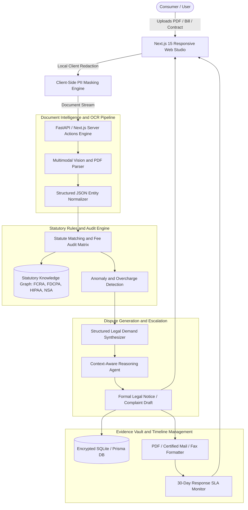

# Architecture & Technical Specification: Bureaucracy and Dispute Advocate

**Project Root:** `D:\projects\Bureaucracy and Dispute Advocate`  
**Version:** 1.0.0-PROD  
**Target Market:** Consumer Rights Defense, Debt Collection Validation, Medical Bill Auditing, Lease Review, and Dark-Pattern Subscription Cancellation.

---

## 1. Executive Summary & Vision

**Bureaucracy and Dispute Advocate** is an autonomous consumer-defense platform designed to eliminate the friction, time sinks, and monetary losses inflicted on consumers by corporate bureaucracy, unfair billing, predatory collections, and convoluted contracts.

### Core Value Drivers:
1. **Automated Line-Item Audit:** Ingests complex invoices, medical bills, utility statements, and loan disclosures; detects billing code errors, inflated charges, duplicate fees, and statutory violations.
2. **Statute-Grounded Legal Demand Generation:** Dynamically pairs detected violations with binding federal/state statutes (FCRA, FDCPA, No Surprises Act, TCPA, FTC Act Section 5, EU Consumer Rights) to generate formal legal dispute letters, debt validation demands, and certified agency complaints.
3. **Evidence Vault and Statutory Deadline Tracker:** Manages dispute timelines with automated countdown clocks for mandatory creditor response windows (e.g., 30-day FCRA/FDCPA rules), escalates non-responsive cases to CFPB/FTC/AG complaints.
4. **Client-Side Privacy First:** Implements zero-retention local redaction of Social Security Numbers, bank details, and health markers before LLM ingestion.

---

## 2. High-Level System Architecture



---

## 3. Technology Stack Breakdown

| Layer | Technology | Justification |
| :--- | :--- | :--- |
| **Frontend Framework** | **Next.js 15 (App Router, React 19)** | Server-side rendering, fast streaming responses, enterprise-grade routing. |
| **Styling & Components**| **Tailwind CSS + Radix UI / Shadcn** | Clean, accessible, modern UI with dark/light mode and low bundle footprint. |
| **Icons & Visuals** | **Lucide-React** | Lightweight, consistent iconography for documents, status badges, and timelines. |
| **OCR & Vision** | **Gemini 3.8 Flash High & Tesseract / PDF.js** | Low-latency multimodal image analysis, zero-shot structured JSON extraction from complex tables. |
| **Statute Engine** | **TypeScript Statutory Rules Engine + Pydantic** | Deterministic rule execution combined with LLM semantic reasoning. |
| **Database & ORM** | **Prisma ORM with SQLite (Local) / PostgreSQL (Cloud)** | Type-safe queries, migration support, zero-hassle local developer setup. |
| **Document Export** | **React-PDF / Puppeteer PDF Generator** | Pixel-perfect legal document rendering with standard legal margins and certified letter layouts. |
| **Security & Cryptography**| **Web Crypto API + AES-256-GCM** | Client-side PII encryption and sensitive field redacting. |

---

## 4. Database Schema Design (Prisma)

```prisma
datasource db {
  provider = "sqlite"
  url      = "file:./dev.db"
}

generator client {
  provider = "prisma-client-js"
}

enum DisputeCategory {
  MEDICAL_BILLING
  DEBT_COLLECTION
  CREDIT_REPORT_ERROR
  SUBSCRIPTION_CANCEL
  RENTAL_LEASE_DISPUTE
  UTILITY_OVERCHARGE
  AIRLINE_PASSENGER_RIGHTS
}

enum DisputeStatus {
  DRAFT
  AUDITED
  LETTER_GENERATED
  SENT
  AWAITING_RESPONSE
  RESOLVED_SETTLED
  ESCALATED_REGULATOR
}

model UserCase {
  id              String           @id @default(cuid())
  title           String
  category        DisputeCategory
  status          DisputeStatus    @default(DRAFT)
  opponentName    String           // e.g., "Memorial Hospital", "Midland Credit Management"
  opponentAddress String?
  accountNumber   String?          // Redacted/masked in UI
  disputedAmount  Float            @default(0.0)
  currency        String           @default("USD")
  
  // Statutory Timelines
  sentDate        DateTime?
  statutoryDays   Int              @default(30) // FCRA/FDCPA 30-day response window
  deadlineDate    DateTime?
  
  // Relationships
  documents       Document[]
  lineItems       AuditLineItem[]
  disputeLetters  DisputeLetter[]
  timelineEvents  TimelineEvent[]
  
  createdAt       DateTime         @default(now())
  updatedAt       DateTime         @updatedAt
}

model Document {
  id          String   @id @default(cuid())
  caseId      String
  fileName    String
  fileType    String   // "pdf", "png", "jpeg"
  fileSize    Int
  filePath    String
  ocrRawText  String?
  parsedJson  String?  // Extracted structured bill/contract JSON
  createdAt   DateTime @default(now())
  userCase    UserCase @relation(fields: [caseId], references: [id], onDelete: Cascade)
}

model AuditLineItem {
  id             String   @id @default(cuid())
  caseId         String
  description    String   // e.g., "CPT Code 99285 Emergency Room Visit"
  billedAmount   Float
  fairAmount     Float?
  isFlagged      Boolean  @default(false)
  flagReason     String?  // e.g., "Unbundled service violation", "Exceeds median regional fee by 280%"
  statuteRef     String?  // e.g., "No Surprises Act Section 300gg-111"
  userCase       UserCase @relation(fields: [caseId], references: [id], onDelete: Cascade)
}

model DisputeLetter {
  id             String   @id @default(cuid())
  caseId         String
  version        Int      @default(1)
  recipientName  String
  recipientAddr  String
  subjectLine    String
  bodyMarkdown   String
  legalCitations String   // JSON array of cited laws
  pdfExportPath  String?
  createdAt      DateTime @default(now())
  userCase       UserCase @relation(fields: [caseId], references: [id], onDelete: Cascade)
}

model TimelineEvent {
  id          String   @id @default(cuid())
  caseId      String
  title       String
  description String
  eventType   String   // "DOCUMENT_UPLOADED", "AUDIT_COMPLETED", "LETTER_SENT", "DEADLINE_ALERT"
  timestamp   DateTime @default(now())
  userCase    UserCase @relation(fields: [caseId], references: [id], onDelete: Cascade)
}
```

---

## 5. Domain-Specific Dispute Modules

### Module A: Medical Bill & No Surprises Act Auditor
* **Problem:** In the US, 80%+ of medical bills contain coding errors (unbundling, upcoding, duplicate room fees).
* **Audit Logic:**
  1. Extracts CPT/HCPCS codes and charges.
  2. Compares against CMS (Centers for Medicare & Medicaid Services) baseline rates and regional benchmarks.
  3. Detects "Balance Billing" violations under the Federal No Surprises Act (42 U.S.C. Section 300gg-111).
  4. Generates an Itemized Bill Demand & Settlement Compromise Letter.

### Module B: FDCPA / Debt Collection Validation Engine
* **Problem:** Debt collectors harass consumers for time-barred (zombie) debts or debts lacking proper chain of custody.
* **Audit Logic:**
  1. Inspects debt collection notices for 15 U.S.C. Section 1692g disclosures.
  2. Validates statute of limitations by jurisdiction.
  3. Generates 30-Day Formal Debt Validation Demand requiring chain-of-title, original agreement, and calculation ledger.
  4. Includes explicit Cease & Desist instructions against phone contact under Section 1692c.

### Module C: Credit Bureau Dispute Synthesizer (FCRA 15 U.S.C. Section 1681)
* **Problem:** Credit reporting agencies (Equifax, Experian, TransUnion) rubber-stamp automated dispute verifications.
* **Audit Logic:**
  1. Formats high-specificity dispute dossiers targeting inaccurate tradelines, dates of delinquency, and payment status.
  2. Demands Method of Verification (MOV) under FCRA Section 611(a)(7).
  3. Sets automated 30-day statutory removal trigger if the bureau fails to respond.

### Module D: Dark-Pattern Subscription & Fee Slayer
* **Problem:** Gyms, telecom carriers, and SaaS vendors deploy phone-only or certified-mail cancellation obstacles.
* **Audit Logic:**
  1. Cites FTC "Click-to-Cancel" rule (16 CFR Part 425) and state auto-renewal statutes (California A.B. 390 / Delaware Uniform Deceptive Trade Practices).
  2. Issues formal notice of revocation of payment authorization under Electronic Fund Transfer Act (EFTA) 15 U.S.C. Section 1693e.

---

## 6. End-to-End Autonomous Agent Workflow

1. **Ingest Phase (Lex - Backend & OCR):**
   * User drops bill or contract into web studio.
   * Client-side redactor detects SSN and sensitive PII; generates masked preview.
   * Document streamed to multimodal parser; extracts structured JSON representation of line items, fees, and parties.

2. **Audit & Analysis Phase (Harvey - Legal Strategist):**
   * Compares extracted line items against statutory rule matrices.
   * Flags discrepancies, unverified surcharges, and non-compliant clauses.
   * Computes disputed dollar value and identifies optimal legal remedy.

3. **Synthesis & Draft Phase (Mercury - Frontend & Letter Engine):**
   * Renders side-by-side interactive studio: annotated document on left, editable formal legal demand on right.
   * Generates downloadable, court-ready PDF with formal legal header, registered mail tracking number slots, and signature block.

4. **Quality & Compliance Phase (Justitia - QA & Auditor):**
   * Verifies all statutory citations against official codified titles.
   * Checks letter tone for professional firmness (no threats or frivolous assertions).
   * Validates calculated statutory deadlines and sets background notification timers.

---

## 7. Delivery Roadmap

* **Phase 1 (MVP Setup):** Next.js 15 project initialization, Tailwind/Radix UI scaffold, Prisma schema setup, file upload pipeline.
* **Phase 2 (Core Modules):** Medical Bill No Surprises Auditor and FDCPA Debt Validation Generator.
* **Phase 3 (Dispute Studio):** Interactive split-view editor, PDF rendering, timeline event tracker.
* **Phase 4 (Automation & Packaging):** Automated email/fax delivery webhooks, regulatory complaint exporter (CFPB/FTC).
