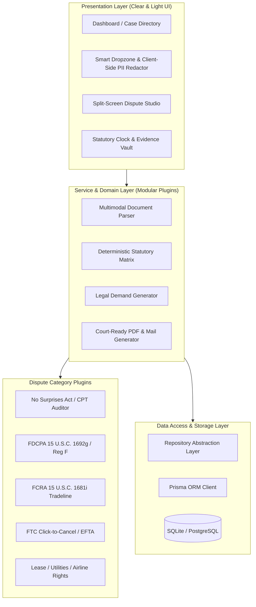

# Prerequisites & Scalability Engineering Specification
**Project:** Bureaucracy & Dispute Advocate  
**Location:** `D:\projects\Bureaucracy and Dispute Advocate`  
**Version:** 1.0.0-PRE-RELEASE  
**Lead:** Harvey (Chief Legal Architect & Senior Engineering Strategist)

---

## 1. Executive Mandate & Architectural Vision

The **Bureaucracy & Dispute Advocate** platform is engineered to dismantle bureaucratic barriers, predatory debt collections, inflated medical bills, and dark-pattern subscriptions for consumers. 

To achieve maximum real-world impact, this platform must be:
1. **Ultra-Scalable:** Built on modular, decoupled services where new dispute categories (landlord-tenant, predatory auto loans, utility overcharges) can be added as isolated plugins without touching core execution code.
2. **Easy to Use & Understand:** Cognitive load must be near zero. Consumers facing debt collectors or medical distress are already overwhelmed; the interface must guide them with plain-language explanations, contextual statutory badges, and automated 3-step resolution flows.
3. **Clear and Light Visual Design:** Clean, distraction-free aesthetic with crisp typography, generous whitespace, soft neutral palettes (`slate-50`, `white`, subtle borders `slate-200`), accessible contrast ratios (WCAG AAA), and an intuitive split-screen dispute studio.
4. **Documentation-Driven Development (DDD):** Every architectural decision, schema change, API route, and statutory rule must have dedicated documentation created in `docs/` before or immediately alongside implementation.

---

## 2. System & Environment Prerequisites

### 2.1 Runtime & Toolchain
- **Node.js:** `>= 20.10.0 LTS` (Recommended: Node.js 22.x LTS)
- **Package Manager:** `npm` (v10+) or `pnpm` (v9+)
- **TypeScript:** `v5.7.2+` with `strict: true`, `noImplicitAny: true`, and path aliasing (`@/* -> ./src/*`)
- **Framework:** Next.js `15.1.0+` utilizing the App Router and Server Actions

### 2.2 Database & Data Persistence
- **Local Dev / Single Node:** SQLite via Prisma ORM (`file:./prisma/dev.db`).
- **Production Scale:** PostgreSQL 16+ with connection pooling (e.g., Supabase / Neon / PgBouncer) — abstractable via the Repository Pattern in Prisma without application-layer rewrites.
- **Prisma Client:** `@prisma/client@^6.0.0` with strict schema validation.

### 2.3 Configuration & Environment Variables (`.env`)
Before executing any service, the following environment keys must be configured in `.env.local`:
```env
# Database
DATABASE_URL="file:./prisma/dev.db"

# AI / Multimodal Vision Engine (Document OCR & Entity Extraction)
GEMINI_API_KEY=""

# Security & Client Privacy
NEXT_PUBLIC_ENABLE_LOCAL_REDACTION="true"
AES_ENCRYPTION_KEY="32-byte-hex-encoded-secret-key"

# Application Settings
NEXT_PUBLIC_APP_URL="http://localhost:3000"
NODE_ENV="development"
```

---

## 3. Scalability & Modular Architecture Blueprint



### 3.1 Core Scalability Principles
1. **Stateless API Routes:** All Next.js API endpoints (`/api/cases`, `/api/audit`, `/api/generate-letter`) remain stateless to allow horizontal scaling across container instances.
2. **Separation of Rule Verification from LLM Reasoning:**
   - **Deterministic Rules (Fast, Free, 100% Consistent):** CPT unbundling, 30-day statutory response calculations, mandatory legal citations are evaluated locally via TypeScript rule matrices.
   - **Generative AI (Contextual Nuance):** Multimodal OCR entity parsing and human-like contextual explanation are delegated to Gemini 3.8 Flash High.
3. **Repository Pattern:** Database interactions are isolated behind service repositories (`CaseRepository`, `DocumentRepository`, `DisputeRepository`), preventing UI or API route coupling to Prisma queries.

---

## 4. UI/UX Clarity & Lightness Guidelines

### 4.1 Design Philosophy: "Clarity, Lightness, and Relief"
Consumers using this tool are under financial or legal stress. The interface must inspire calm, confidence, and effortless comprehension:
- **Backgrounds:** Pure white (`#FFFFFF`) with soft neutral canvas backdrops (`slate-50` / `#F8FAFC`).
- **Typography:** High-contrast, clean sans-serif typography (`Inter` / system sans-serif) with generous line-height (`leading-relaxed`).
- **Borders & Elevation:** Crisp, hairline borders (`border-slate-200`) and soft, minimal shadows (`shadow-sm`) instead of heavy dark containers.
- **Accents:** Professional slate-900 primary buttons, subtle indigo/sky highlights for active selections, and unambiguous status indicators:
  - 🟢 **Success / Resolved:** `emerald-600` on `emerald-50`
  - 🟡 **Pending / Review:** `amber-600` on `amber-50`
  - 🔴 **Violation / Flagged:** `rose-600` on `rose-50`
  - 🔵 **Statutory Clocks:** `sky-600` on `sky-50`

### 4.2 Split-Screen Dispute Studio Layout
- **Left Pane (50% Width):** Source document visualizer with interactive bounding boxes and hoverable violation tooltips.
- **Right Pane (50% Width):** Live Markdown/Rich-text legal dispute letter with toggleable statutory citation clauses, editable certified mail fields, and instant 1-click PDF download.

---

## 5. Mandatory Step-by-Step Documentation Protocol

To maintain complete architectural clarity and eliminate technical debt, **every phase of implementation must strictly follow this 5-step documentation protocol**:

1. **Step Specification:** Before touching code, document the target deliverable, affected files, and acceptance criteria in `docs/steps/<STEP_NAME>.md`.
2. **Interface Definition:** Document all TypeScript types, API contracts, and database schema diffs.
3. **Implementation & In-Code Documentation:** Write clean, modular TypeScript with descriptive JSDoc comments for all public methods and components.
4. **Compliance & Verification:** Justitia audits the step against statutory rules and security/PII requirements, logging test results in `docs/compliance/`.
5. **Phase Log & Team Memory Update:** Record the milestone in `PROJECT_PHASES.md` and update `TEAM_MEMORY.md`.

---

## 6. Team Bot Roles, Identities & Standing Instructions

| Bot Name | Role | Core Responsibility | Standing Directive |
| :--- | :--- | :--- | :--- |
| **Harvey (Legal Strategist)** | Chief of Staff & Chief Legal Architect | Statutory mapping, demand synthesis, team coordination, architecture oversight | Enforce strict statutory accuracy (zero hallucinated citations); uphold documentation protocol; lead overall project delivery. |
| **Lex (Backend & OCR)** | Lead Backend & Document Intelligence Engineer | API endpoints, Prisma ORM, repository layer, multimodal OCR parsing, zero-PII leak security | Build scalable, typed, stateless backend services; document all schemas and API routes in `docs/backend/`. |
| **Mercury (Frontend Lead)** | Lead UI/UX & Full-Stack Frontend Engineer | Next.js 15 App Router, Radix/Tailwind components, clear & light design system, split-screen studio | Craft intuitive, accessible (WCAG AAA), distraction-free interfaces; document component APIs in `docs/ui/`. |
| **Justitia (QA & Compliance)** | Quality Assurance & Statutory Compliance Auditor | Test suites, statutory citation verification, deadline accuracy, PII redaction checks | Audit every dispute template, route, and UI state; maintain audit logs in `docs/compliance/` and `docs/qa/`. |

---

## 7. Execution Readiness Checklist

- [x] High-level architecture validated in `ARCHITECTURE.md`.
- [x] Prisma database schema codified in `prisma/schema.prisma`.
- [x] Initial statutory rule matrices defined in `src/lib/statutes/rules.ts`.
- [x] Dispute letter templates seeded in `src/lib/templates/disputeLetters.ts`.
- [x] Comprehensive prerequisites and scalability blueprint codified in `PREREQUISITES.md`.
- [ ] Team bot SOULs, skills, and memory updated via OpenMausBot governance tools.
- [ ] Setup documentation directory structure (`docs/architecture/`, `docs/api/`, `docs/ui/`, `docs/compliance/`).
