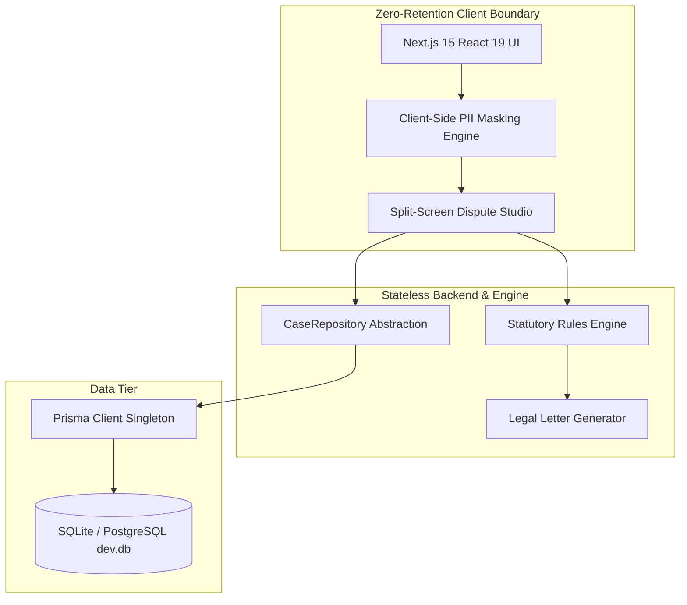

# Bureaucracy & Dispute Advocate

> **Autonomous Consumer Legal Defense & Bureaucracy Navigator**  
> Audits medical bills, enforces FDCPA debt validation, disputes credit report inaccuracies, and cancels stubborn subscriptions using codified federal statutes.

[](https://nextjs.org/)
[](https://react.dev/)
[](https://www.prisma.io/)
[](https://tailwindcss.com/)
[](https://opensource.org/licenses/MIT)

---

## 🏛️ Project Overview

Over 80% of consumer debt collection notices and medical billing statements contain statutory violations, unbundled procedure codes, or inflated charges. **Bureaucracy & Dispute Advocate** automates consumer rights enforcement:

1. **Client-Side Zero-Retention Privacy:** Scrub sensitive SSNs, bank accounts, and MRNs in-browser before any data leaves the client.
2. **Statutory Rules Engine:** Maps billing discrepancies directly to codified federal laws:
   - **No Surprises Act (42 U.S.C. § 300gg-111 & 45 CFR § 149):** Out-of-network balance billing prohibitions and itemized ledger demands.
   - **Fair Debt Collection Practices Act (15 U.S.C. § 1692g & CFPB Reg F):** 30-day formal debt validation, chain-of-title verification, and telephone cease-and-desist.
   - **Fair Credit Reporting Act (15 U.S.C. § 1681i):** Tradeline accuracy challenges and Method of Verification (MOV) requests.
   - **FTC Click-to-Cancel & EFTA (16 CFR Part 425 & 15 U.S.C. § 1693e):** Recurring debit authorization revocation and cancellation symmetry enforcement.
3. **Split-Screen Dispute Studio:** Inspect source documents side-by-side with live-editable, court-ready legal demand letters.
4. **Statutory Clocks & Escalation Engine:** Tracks 30-day statutory response windows with one-click escalation to the CFPB, CMS, FTC, or state Attorney General.

---

## 📐 System Architecture



---

## 📚 Master Documentation Index

We enforce a strict **Step-by-Step Documentation Protocol** (`docs/standards/DOCUMENTATION_PROTOCOL.md`). Every phase and component is meticulously documented:

* 📖 **[Documentation Hub](docs/README.md):** Complete catalog of all platform specifications.
* 📋 **[Prerequisites & Standards](PREREQUISITES.md):** Environment setup, database standards, and cognitive-ease UX directives.
* 🗺️ **[Project Execution Phases](PROJECT_PHASES.md):** 6-phase roadmap, specialist assignments, and exit gates.
* 🏛️ **[Technical Architecture](ARCHITECTURE.md):** Comprehensive system blueprint and data models.
* 🔌 **[Scalability & Modularity](docs/architecture/SCALABILITY_AND_MODULARITY.md):** Plug-and-play dispute category architecture.
* 💾 **[Database & Repository Pattern](docs/architecture/DATABASE_AND_REPO_PATTERN.md):** Decoupled repository data layer specifications.
* 🛡️ **[Zero-Retention PII Audit](docs/compliance/ZERO_PII_RETENTION_AUDIT.md):** HIPAA, GLBA, and FCRA privacy compliance safeguards.
* 🎨 **[Clear & Light Design System](docs/ui/DESIGN_SYSTEM_CLEAR_AND_LIGHT.md):** Visual hierarchy, color tokens, and WCAG AAA accessibility.

### Milestone Step Logs
* 🏁 **[Step 00: Prerequisites Setup](docs/steps/STEP_00_PREREQUISITES_SETUP.md)**
* 🚀 **[Step 01: Core Foundation & Privacy Engine](docs/steps/STEP_01_CORE_FOUNDATION.md)**

---

## 💻 Tech Stack & Dependencies

- **Framework:** Next.js 15.1 (App Router)
- **UI Library:** React 19, Tailwind CSS, Lucide React
- **ORM & Database:** Prisma ORM 6.0 with SQLite (`prisma/dev.db`)
- **Data Validation:** Zod
- **Typography & Styling:** Clear & Light Design System (Slate/Zinc palette)

---

## 🚀 Getting Started

### 1. Clone & Install
```bash
git clone https://github.com/akmaurya7/Bureaucracy-and-Dispute-Advocate.git
cd Bureaucracy-and-Dispute-Advocate
npm install
```

### 2. Environment Configuration
```bash
cp .env.example .env
```

### 3. Database Initialization
```bash
npx prisma generate
npx prisma db push
```

### 4. Run Development Server
```bash
npm run dev
```
Open [http://localhost:3000](http://localhost:3000) in your browser.

### 5. Verify Zero-Retention Privacy & Production Build
```bash
# Verify client-side PII redactor
node tests/verifyRedactor.js

# Build production application
npm run build
```

---

## 👥 Bot Team Roster

* **Harvey (Chief Legal Architect & Senior Engineering Strategist):** Directs statutory compliance, dispute tactics, and code architecture.
* **Lex (Backend & OCR Lead):** Manages Prisma repository data layer, document pipelines, and OCR models.
* **Mercury (Frontend Lead):** Develops the responsive Next.js 15 UI, clear & light design system, and split-screen studio.
* **Justitia (QA & Compliance Auditor):** Audits statutory citations, prevents legal hallucinations, and tests zero-leak privacy controls.

---

## 📄 License
MIT License. Open-source for consumer empowerment and public interest legal defense.
