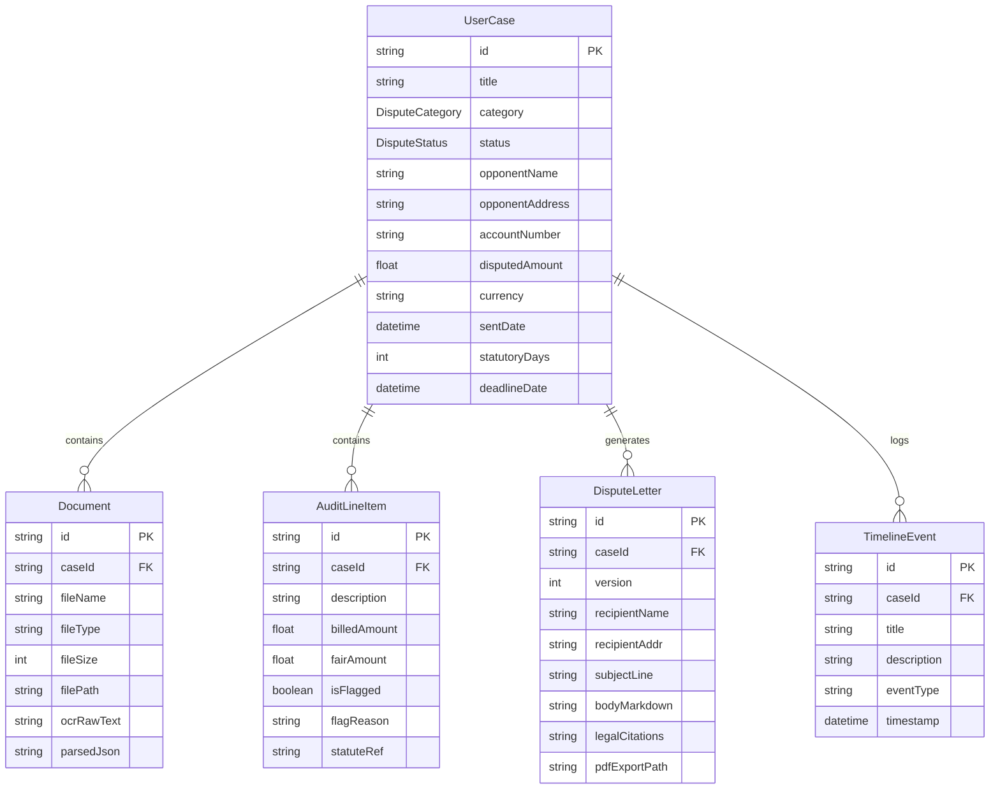

# Database Architecture & Repository Pattern

**Specification:** ARCH-DATA-001  
**Lead:** Lex (Backend & Document Intelligence Lead)  
**Reviewed by:** Harvey (Chief Strategist)

---

## 1. Relational Entity Model

The platform data model in `prisma/schema.prisma` is organized around the `UserCase` root aggregate:



---

## 2. Decoupled Repository Pattern

To ensure **scalability, testability, and portability** (switching between SQLite for local edge deployment and PostgreSQL/CockroachDB for multi-tenant cloud), UI components and API handlers never call `@prisma/client` directly.

Instead, all database operations route through the `CaseRepository` class:

```
[UI Component / Server Action]
          │
          ▼
[CaseRepository (src/lib/db/caseRepository.ts)]
          │
          ▼
[Prisma Client Singleton (src/lib/db/prisma.ts)]
          │
          ▼
[Database (SQLite / PostgreSQL)]
```

### Benefits:
1. **Zero Vendor Lock-In:** Allows testing with in-memory SQLite or mock repositories without launching a full DB.
2. **Atomic Consistency:** Cascading deletes, status transitions, and timeline logging are encapsulated in repository methods.
3. **Stateless Scalability:** Connection pooling and retry logic are managed centrally in `prisma.ts`.
